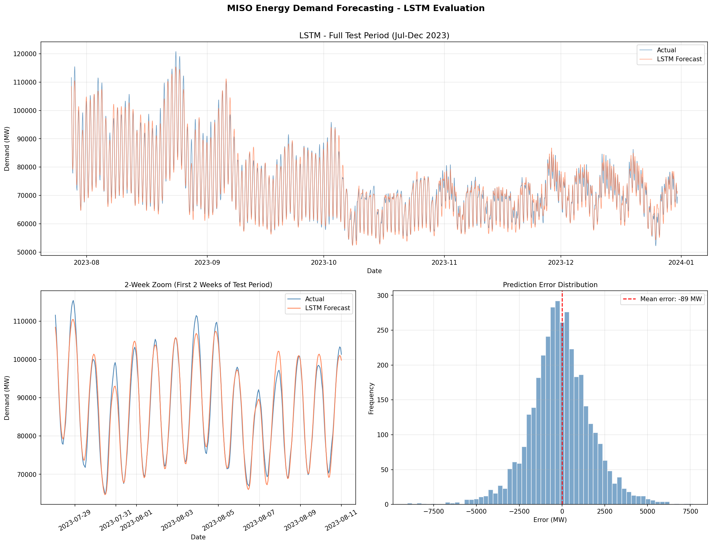
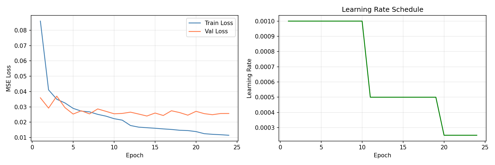

# ⚡ MISO Energy Demand Forecasting

A PyTorch LSTM model for hourly electricity demand forecasting in the Midcontinent Independent System Operator (MISO) region. Trained on 3 years of EIA hourly demand data paired with weather observations from Chicago O'Hare.

[](https://misoenergyloadforecasting.streamlit.app/)

---

## Exploratory Data Analysis

Full EDA with findings, visualizations, and feature selection analysis:

📓 **[View EDA Notebook](notebooks/01_eda.ipynb)**

Key findings:
- Strong multi-scale seasonality confirmed (annual, daily, weekly cycles)
- U-shaped temperature-demand relationship justifies neural network over linear model
- Autocorrelation of 0.923 at 24hr lag and 0.779 at 168hr lag justifies lag features and 168hr sequence length
- LSTM reduced residual autocorrelation by 70-89% at key lags — feature set successfully captured dominant temporal structure
- No features identified for removal — all 13 features carry independent information

## Results

| Model | MAE | RMSE | MAPE |
|:---|---:|---:|---:|
| Persistence Baseline | 3,190 MW | 4,344 MW | 4.30% |
| Random Forest | 1,740 MW | 2,397 MW | 2.26% |
| **LSTM (this model)** | **1,351 MW** | **1,800 MW** | **1.82%** |

The LSTM achieves **1.82% MAPE** on the held-out test set (Jul–Dec 2023) — a 58% improvement over the naive persistence baseline and 19% improvement over a Random Forest benchmark.

---

## Live Demo

Explore the model interactively — select any date range from the test set and see actual vs predicted demand with live metrics:

🔗 **[misoenergyloadforecasting.streamlit.app](https://misoenergyloadforecasting.streamlit.app/)**



---

## Project Structure

```
energy-load-forecasting/
├── data/
│   └── processed/
│       └── features.csv          # Engineered feature matrix (26,068 rows)
├── models/
│   ├── best_model.pt             # Trained LSTM weights
│   ├── feature_scaler.pkl        # Fitted StandardScaler for features
│   ├── target_scaler.pkl         # Fitted StandardScaler for target
│   └── training_history.png      # Loss curves
├── notebooks/
│   └── 01_eda.ipynb              # Exploratory data analysis
├── src/
│   ├── data_pipeline.py          # EIA API fetch and data ingestion
│   ├── features.py               # Feature engineering
│   ├── dataset.py                # PyTorch Dataset and DataLoader
│   ├── model.py                  # LSTM architecture
│   ├── train.py                  # Training loop with early stopping
│   └── evaluate.py               # Metrics and visualizations
├── app/
│   └── streamlit_app.py          # Interactive Streamlit application
├── requirements.txt
└── README.md
```

---

## Methodology

### Data Sources
- **Demand:** [EIA Open Data API](https://www.eia.gov/opendata/) — MISO region hourly electricity demand
- **Weather:** [Iowa Environmental Mesonet (IEM)](https://mesonet.agron.iastate.edu/) — Chicago O'Hare hourly temperature
- **Period:** January 2021 – December 2023
- **Frequency:** Hourly (26,068 records after processing)

### Feature Engineering
| Feature | Description |
|:---|:---|
| `hour_sin`, `hour_cos` | Cyclical encoding of hour of day (24-hr cycle) |
| `dow_sin`, `dow_cos` | Cyclical encoding of day of week (7-day cycle) |
| `month_sin`, `month_cos` | Cyclical encoding of month (12-month cycle) |
| `lag_24` | Demand 24 hours prior (same time yesterday) |
| `lag_48` | Demand 48 hours prior |
| `lag_168` | Demand 168 hours prior (same time last week) |
| `rolling_mean_24` | 24-hour rolling mean demand |
| `rolling_mean_168` | 7-day rolling mean demand |
| `temp_c` | Hourly temperature in Celsius |
| `is_holiday` | US federal holiday flag |

Cyclical encoding is used for time features to preserve circular relationships — hour 23 and hour 0 are adjacent, not distant.

### Model Architecture

```
Input (batch=32, seq_len=168, features=13)
        ↓
  LSTM Layer 1  (hidden_size=128)
        ↓
  LSTM Layer 2  (hidden_size=128)
        ↓
  Last hidden state
        ↓
  Dropout (p=0.2)
        ↓
  Linear (128 → 1)
        ↓
  Output: predicted demand (MW)
```

**Why LSTM?** Electricity demand exhibits strong temporal dependencies — hourly, daily, and weekly cycles. LSTMs are designed to capture long-range dependencies in sequential data, making them well-suited for this problem.

**Sequence length: 168 hours (1 week)** — chosen to capture the full weekly demand cycle directly from the input sequence.

### Training
| Parameter | Value |
|:---|:---|
| Optimizer | Adam (lr=0.001) |
| Loss | Mean Squared Error (MSE) |
| Epochs | 24 (early stopping at patience=10) |
| LR Scheduler | ReduceLROnPlateau (factor=0.5, patience=5) |
| Gradient Clipping | max_norm=1.0 |
| Train/Val/Test Split | 70% / 15% / 15% (chronological) |



---

## Running Locally

**1. Clone the repository**
```bash
git clone https://github.com/jreinert/energy-load-forecasting.git
cd energy-load-forecasting
```

**2. Create and activate conda environment**
```bash
conda create -n energy-forecasting python=3.11 -y
conda activate energy-forecasting
pip install -r requirements.txt
```

**3. Run the Streamlit app**
```bash
streamlit run app/streamlit_app.py
```

**4. Re-run training from scratch (optional)**

Add your EIA API key to a `.env` file:
```
EIA_API_KEY=your_key_here
```

Then:
```bash
python src/data_pipeline.py
python src/features.py
python src/train.py
python src/evaluate.py
```

---

## Tech Stack

`Python` `PyTorch` `scikit-learn` `pandas` `NumPy` `Streamlit` `Plotly` `Databricks-compatible`

---

## Author

**Jeremy Reinert**
Data Scientist & Senior Data Engineer | End-to-end data professional

[](https://www.linkedin.com/in/jeremy-reinert/)
[](https://github.com/jreinert)